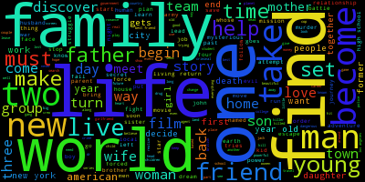
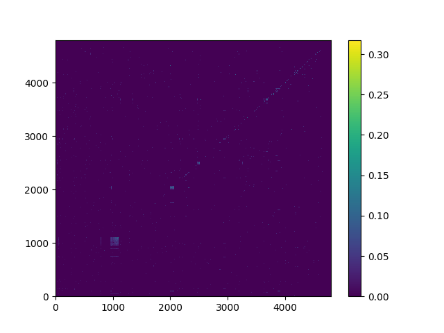
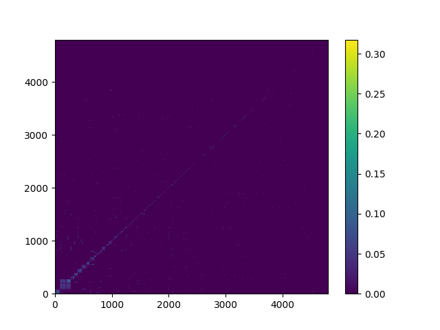

# Movie Recommendation
Um sistema inteligente de recomendação de filmes.

# Dados
A importância da remoção de _stop words_ está relacionada

### Frequência de palavras:
Word | Count | Word | Count
---- | ----- | ---- | -----
the | 12695 | in | 4058
a | 9340 | his | 3883
to | 7849 | is | 3318
and | 7267 | with | 2349
of | 6847 | her | 1968

### Frequência de palavras (Sem _stop words_):
Word | Count | Word | Count
---- | ----- | ---- | -----
life | 804 | two | 538
new | 714 | man | 506
one | 685 | family | 496
young | 629 | find | 473
world | 568 | story | 450

# Clusters
Método: ward

Método: single

Método: average

Método: complete

