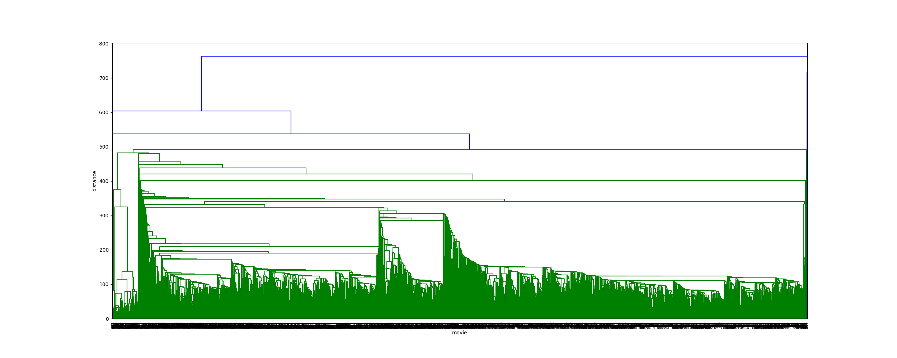
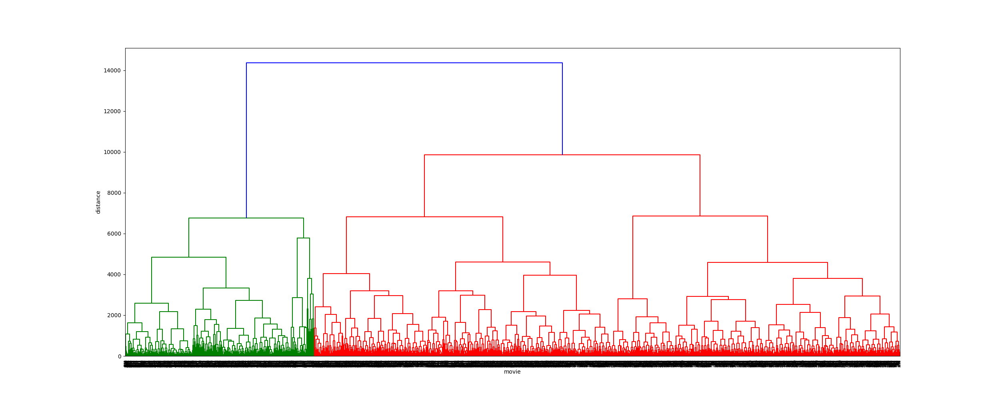
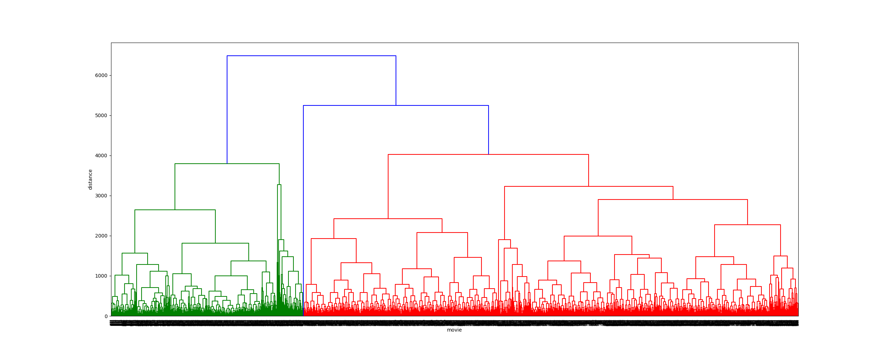
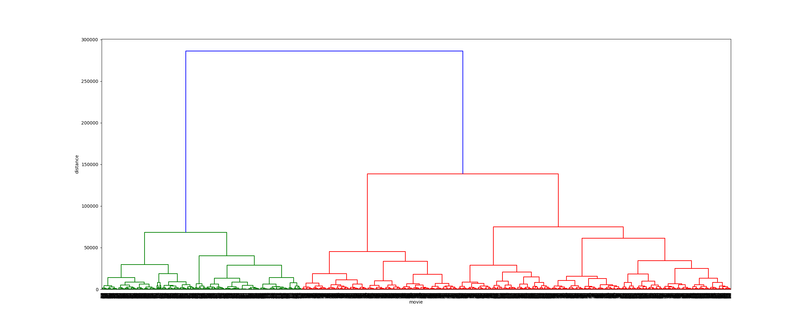
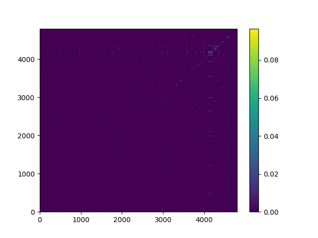
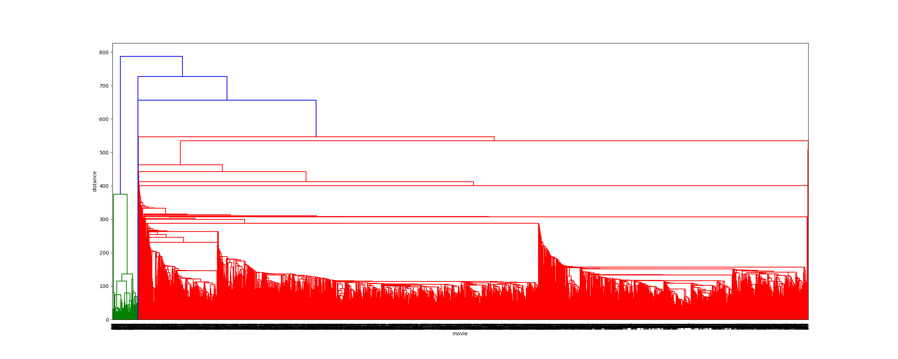
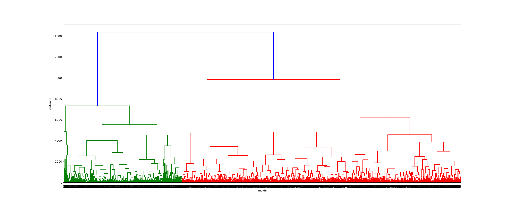
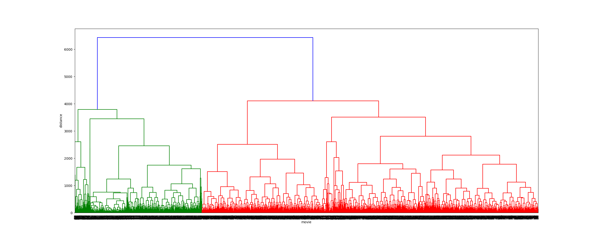
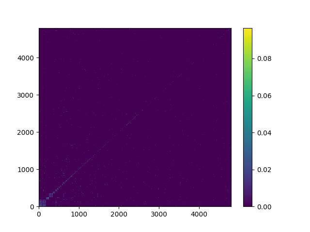
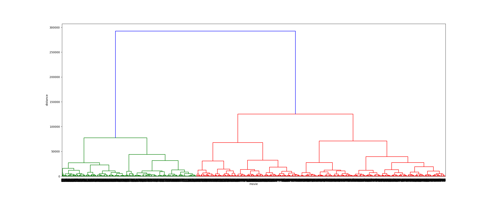

# Movie Recommendation
Um sistema inteligente de recomendação de filmes.

# Uso
Os principais programas que compõem esta aplicação são:

- `csv_to_json.py`: gera o arquivo .json com os dados a serem utilizados.
- `full_generation.py`: realiza todo o processo de clusterização e geração de imagens (matrizes de distância e dendrogramas).
- `user_permission.py`: Obtém a permissão de acesso do usuário.
- `user_data.py`: Realiza a coleta dos filmes ranqueados pelo usuário.
- `recommend.py`: Gera uma lista de recomendações de filmes para o usuário.

Os demais programas são funções e testes. Para funcionamento correto do programa, é necessário que o arquivo `tmdb_5000_movies.csv` esteja presente na pasta `dataset`. Além disso, é necessário um token de API para utilização dos dados do TMDB, você pode obter um token gratuito seguindo o processo descrito nesta página: https://developers.themoviedb.org/3/getting-started/introduction

# Dados

### Frequência de palavras:
Word | Count | Word | Count
---- | ----- | ---- | -----
the | 12695 | in | 4058
a | 9340 | his | 3883
to | 7849 | is | 3318
and | 7267 | with | 2349
of | 6847 | her | 1968

### Frequência de palavras (Sem _stop words_):
Word | Count | Word | Count
---- | ----- | ---- | -----
life | 804 | two | 538
new | 714 | man | 506
one | 685 | family | 496
young | 629 | find | 473
world | 568 | story | 450

# Clusters

### Jaccard Distance
Método   | Matriz de Distância | Dendrograma
-------- | ------------------- | -----------
Single   |  | 
Complete |  | 
Average  |  | 
Ward     |  | 

### Masi Distance
Método   | Matriz de Distância | Dendrograma
-------- | ------------------- | -----------
Single   |  | 
Complete |  | 
Average  |  | 
Ward     |  | 

